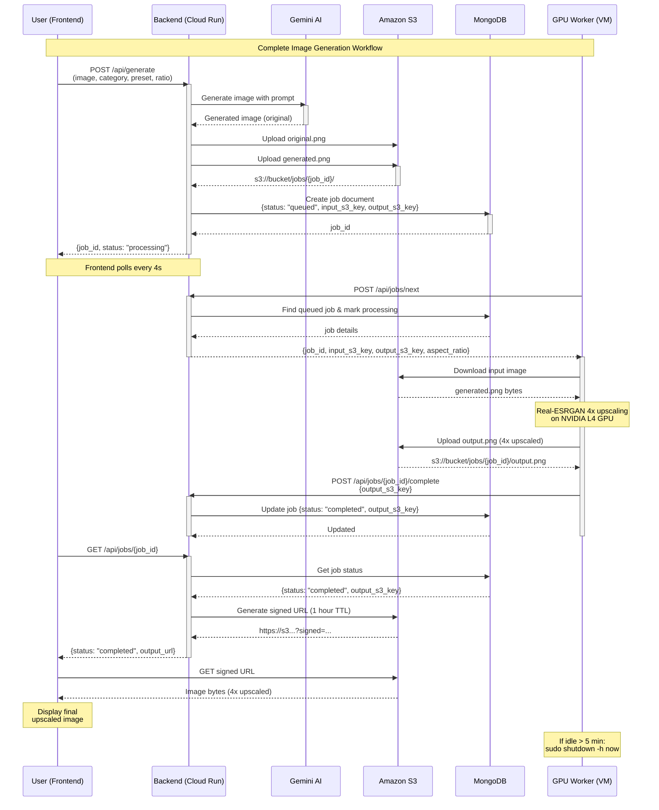

## Key Points:

### ⚡ Performance
- **Gemini generation**: ~10-30s
- **S3 upload**: <1s
- **GPU upscaling**: ~5-15s depending on image size
- **Total**: ~20-50s end-to-end

### 💰 Cost Optimization
- GPU VM only runs when processing jobs
- Auto-shuts down after 5 minutes of inactivity
- Cloud Run scales to zero when not in use
- S3 storage: only pay for what you store

### 🔒 Security
- Signed S3 URLs with 1-hour expiration
- AWS credentials stored as environment variables
- No images stored in MongoDB (only references)
- Worker authentication via Worker-Id header

### 🎯 Scalability
- Multiple workers can run simultaneously
- Jobs processed in FIFO order
- MongoDB ensures atomic job claiming
- S3 handles unlimited concurrent downloads

### 🛡️ Reliability
- Job status tracking in MongoDB
- Failed jobs marked explicitly
- Frontend polls until completion
- Worker errors logged and reported
